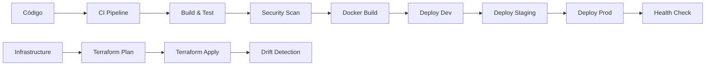

# 🎯 Visão Geral - GitHub Actions Workflows Hub

## 📋 O que é este projeto?

O **GitHub Actions Workflows Hub** é um repositório centralizado de workflows e actions reutilizáveis do GitHub Actions, projetado para padronizar e acelerar pipelines de CI/CD em toda a organização.

## 🎯 Objetivos

### Principais Benefícios
- ✅ **Padronização**: Processos uniformes em todos os projetos
- ✅ **Reutilização**: Reduz duplicação de código e esforço
- ✅ **Manutenibilidade**: Atualizações centralizadas beneficiam todos
- ✅ **Qualidade**: Workflows testados e otimizados
- ✅ **Velocidade**: Setup rápido de pipelines complexos
- ✅ **Governance**: Controle centralizado de práticas DevOps

### Problemas que Resolve
- 🔄 Duplicação de workflows similares entre repositórios
- 🐛 Inconsistências em processos de CI/CD
- ⏰ Tempo excessivo configurando pipelines básicos
- 🔧 Dificuldade de manter workflows atualizados
- 📊 Falta de padronização em métricas e relatórios

## 🏗️ Arquitetura do Projeto

```
gh-actions-workflows-hub/
├── .github/
│   ├── actions/              # Actions compostas reutilizáveis
│   │   ├── setup-tools/      # Setup de ferramentas de desenvolvimento
│   │   ├── terraform-validate/  # Validação Terraform
│   │   ├── terraform-deploy/    # Deploy Terraform
│   │   ├── aws-deploy/          # Deploy AWS
│   │   └── azure-deploy/        # Deploy Azure
│   └── workflows/            # Workflows reutilizáveis
│       ├── ci-reusable.yml      # CI genérico
│       ├── docker-build.yml     # Build Docker
│       ├── terraform-cicd.yml   # Terraform CI/CD
│       ├── aws-cdk-deploy.yml   # AWS CDK
│       ├── azure-bicep-deploy.yml # Azure Bicep
│       ├── multi-env-deploy.yml # Deploy multi-ambiente
│       └── blue-green-deploy.yml # Blue-Green deploy
├── templates/                # Templates para diferentes cenários
├── examples/                 # Exemplos práticos de uso
└── docs/                    # Documentação completa
```

## 🧩 Componentes Principais

### 1. 🔧 Actions Compostas
Actions reutilizáveis para tarefas específicas:

- **setup-tools**: Configuração de ferramentas (Node, Python, Terraform, etc.)
- **terraform-validate**: Validação e planejamento Terraform
- **terraform-deploy**: Deploy seguro com Terraform
- **aws-deploy**: Deploy para serviços AWS (Lambda, ECS, S3, etc.)
- **azure-deploy**: Deploy para serviços Azure (WebApp, Functions, etc.)

### 2. 🔄 Workflows Reutilizáveis
Workflows completos para diferentes cenários:

- **CI Reusable**: Pipeline de integração contínua genérico
- **Docker Build**: Build e push de imagens Docker multi-arch
- **Terraform CI/CD**: Pipeline completo para infrastructure as code
- **AWS CDK Deploy**: Deploy usando AWS CDK
- **Azure Bicep Deploy**: Deploy usando Azure Bicep
- **Multi-Environment Deploy**: Deploy em múltiplos ambientes
- **Blue-Green Deploy**: Estratégia de deploy blue-green

### 3. 📄 Templates
Templates prontos para diferentes tipos de projeto:

- **Node.js App**: Aplicações Node.js com CI/CD completo
- **Terraform AWS**: Infrastructure as Code com Terraform
- **Azure Bicep**: Infrastructure as Code com Bicep
- **Container Apps**: Aplicações containerizadas

## 🎨 Tecnologias Suportadas

### 🔤 Linguagens e Frameworks
- **Node.js** (npm, yarn)
- **Python** (pip, poetry)
- **Java** (Maven, Gradle)
- **Go** (modules)
- **.NET** (NuGet)

### ☁️ Clouds Suportadas
- **AWS** (Lambda, ECS, S3, CloudFormation, CDK)
- **Azure** (Web Apps, Functions, Container Instances, Bicep)
- **GCP** (Em desenvolvimento)

### 🏗️ Infrastructure as Code
- **Terraform** (validate, plan, apply, destroy)
- **AWS CDK** (TypeScript, Python)
- **Azure Bicep** (ARM templates)
- **Pulumi** (Em desenvolvimento)

### 🐳 Containers
- **Docker** (build, push, multi-arch)
- **Kubernetes** (deploy, rolling updates)
- **Helm** (charts deployment)

## 🔄 Fluxo de Trabalho Típico



## 📊 Métricas e KPIs

O hub fornece insights sobre:
- ⏱️ **Tempo de Build**: Duração média dos pipelines
- ✅ **Taxa de Sucesso**: Porcentagem de deploys bem-sucedidos
- 🔄 **Frequência de Deploy**: Deploys por período
- 🐛 **Mean Time to Recovery (MTTR)**: Tempo médio de recuperação
- 📈 **Lead Time**: Tempo do commit ao deploy em produção

## 🎯 Casos de Uso

### 1. 🚀 Startup/Equipe Pequena
- Setup rápido de CI/CD profissional
- Foco no produto, não na infraestrutura
- Crescimento escalável

### 2. 🏢 Empresa Média
- Padronização entre equipes
- Redução de overhead DevOps
- Compliance e governance

### 3. 🏭 Enterprise
- Governança centralizada
- Conformidade regulatória
- Multi-cloud strategy
- Thousands of repositories

## 🔮 Roadmap

### ✅ Fase 1 - Fundação (Atual)
- Actions e workflows básicos
- Suporte AWS e Azure
- Terraform e Bicep
- Documentação inicial

### 🚧 Fase 2 - Expansão (Próximo)
- Suporte GCP
- Workflows Kubernetes
- Pulumi support
- Advanced testing strategies

### 🎯 Fase 3 - Avançado (Futuro)
- ML/AI pipelines
- Advanced security scanning
- Cost optimization
- Self-healing infrastructure

## 📈 Benefícios Mensuráveis

Com a adoção deste hub, organizações reportam:

- 🕒 **60-80% redução** no tempo de setup de pipelines
- 🏗️ **90% menos duplicação** de código de CI/CD
- 🔧 **50% menos tempo** gasto em manutenção
- ✅ **40% melhoria** na taxa de sucesso de deploys
- 📊 **Padronização 100%** em práticas DevOps

## 🚀 Próximos Passos

1. 📖 Leia o [Guia de Setup](setup.md)
2. 🏃‍♂️ Siga o [Quickstart](quickstart.md)
3. 📝 Explore os [Examples](../examples/)
4. 🔧 Customize conforme necessário
5. 📢 Compartilhe feedback e contribuições

---

> 💡 **Dica**: Este hub é um projeto vivo. Contribua com melhorias, relate bugs e sugira novas funcionalidades através das [issues](../../issues)!